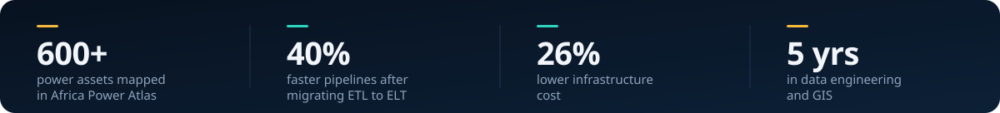

  &nbsp;
  &nbsp;
  

I came to data engineering through GIS. Three years of designing geodatabases for urban planning showed me how fragmented real-world spatial data is, so now I build the pipelines that clean it, model it and put it on a map. I work as a Data Engineer at **Data Science East Africa**, where I own the ETL behind inventory and logistics analytics.

## Featured work

<table>
<tr>
<td width="50%" valign="top">
<h3><a href="https://github.com/Ambuso/Africa-Power-Atlas">Africa Power Atlas</a></h3>

An interactive map of Africa's power system: 600+ power plants, transmission lines and substations, filterable by fuel type and renewables. A Python step cleans and unifies the raw GeoJSON before the map renders it.

<code>Next.js</code> <code>MapLibre GL</code> <code>Python</code> <code>GeoJSON</code>

<a href="https://africapowergrid.vercel.app/"><b>Live map</b></a> &nbsp;·&nbsp; <a href="https://github.com/Ambuso/Africa-Power-Atlas">Source</a>

</td>
<td width="50%" valign="top">
<h3><a href="https://github.com/Ambuso/Dw-Youtube-Channel-Analysis">YouTube Channel Analytics Pipeline</a></h3>

A daily Airflow pipeline that pulls channel analytics from the YouTube API, transforms them with Spark, loads them into PostgreSQL and feeds Grafana dashboards.

<code>Airflow</code> <code>PySpark</code> <code>PostgreSQL</code> <code>Grafana</code>

<a href="https://github.com/Ambuso/Dw-Youtube-Channel-Analysis">Source</a>

</td>
</tr>
<tr>
<td width="50%" valign="top">
<h3><a href="https://github.com/Ambuso/Crypto-etl-airflow">Crypto Price ETL</a></h3>

An Airflow pipeline that captures cryptocurrency prices into PostgreSQL on a schedule, with a notebook that analyses the price history.

<code>Airflow</code> <code>Python</code> <code>PostgreSQL</code>

<a href="https://github.com/Ambuso/Crypto-etl-airflow">Source</a>

</td>
<td width="50%" valign="top">
<h3><a href="https://github.com/Ambuso/ambusoetl">ambusoetl</a></h3>

An installable Python package that extracts current weather from the OpenWeatherMap API, reshapes it with pandas and loads it into PostgreSQL.

<code>Python</code> <code>pandas</code> <code>PostgreSQL</code>

<a href="https://github.com/Ambuso/ambusoetl">Source</a>

</td>
</tr>
</table>

## Toolbox

<table>
<tr>
<td><b>Languages</b></td>
<td>  </td>
</tr>
<tr>
<td><b>Pipelines</b></td>
<td>    </td>
</tr>
<tr>
<td><b>Storage</b></td>
<td>   </td>
</tr>
<tr>
<td><b>Cloud</b></td>
<td>    </td>
</tr>
<tr>
<td><b>Geospatial</b></td>
<td>    </td>
</tr>
<tr>
<td><b>Dashboards</b></td>
<td>  </td>
</tr>
</table>

## Experience

| | Role | Focus |
|---|---|---|
| **2026&nbsp;to&nbsp;now** | Data Engineer, Data Science East Africa | ETL pipelines for inventory and logistics analytics, data quality standards, Grafana and Tableau dashboards |
| **2023&nbsp;to&nbsp;2025** | GIS Expert, Renaissance Planning | PostgreSQL geodatabases and Python/GeoPandas workflows for urban planning projects |
| **2022** | Data Engineer, Ngeni Labs | Moved legacy ETL to ELT on dbt, Snowflake and Fivetran: 40% faster pipelines, 26% lower infrastructure cost |

## Right now

- Studying for the AWS Data Engineer Associate certification
- Writing up geospatial data engineering case studies
- Going deeper on Spark, Kafka and Databricks

Want to talk data, maps or energy infrastructure? <a href="https://www.linkedin.com/in/dismas-mike-ba14362b1/">LinkedIn</a> or <a href="mailto:dismasmik3@gmail.com">email</a> is the fastest way to reach me.

